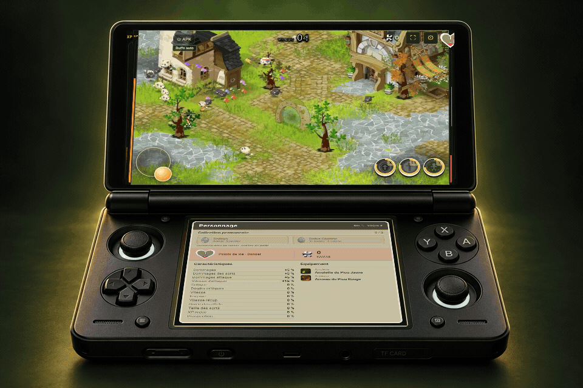
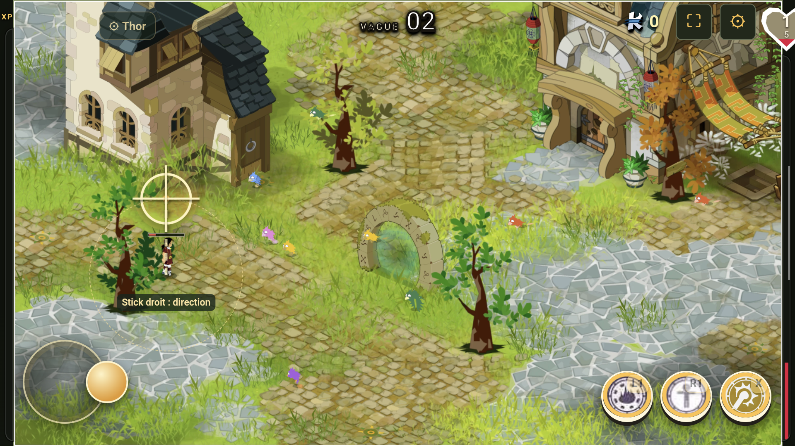
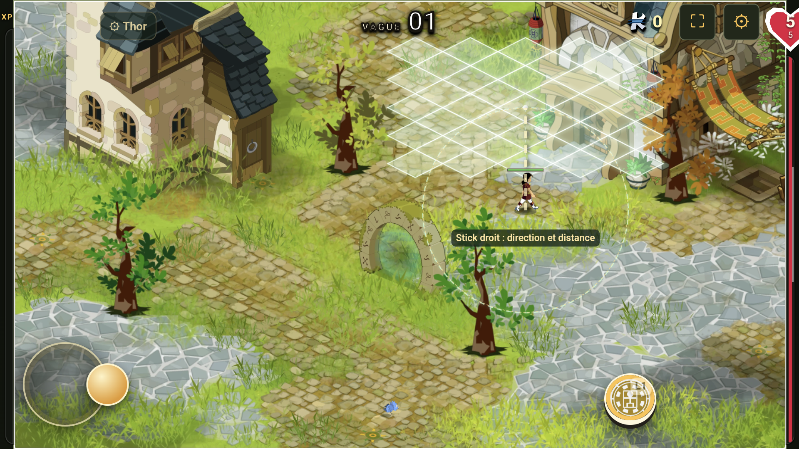
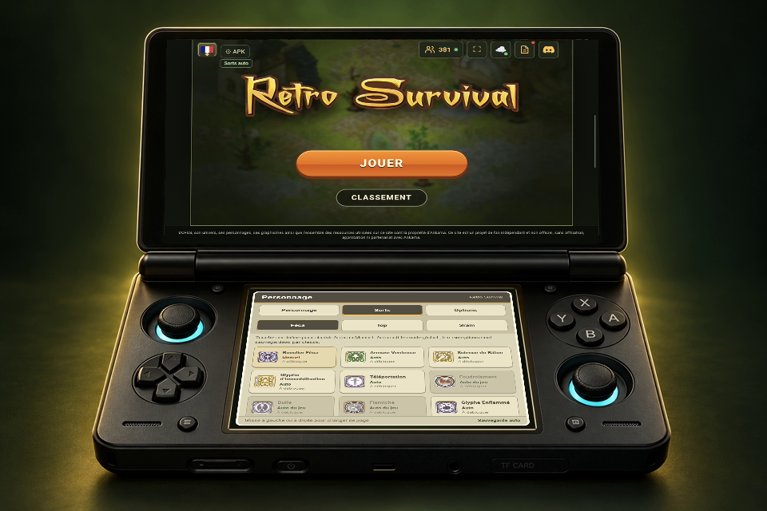
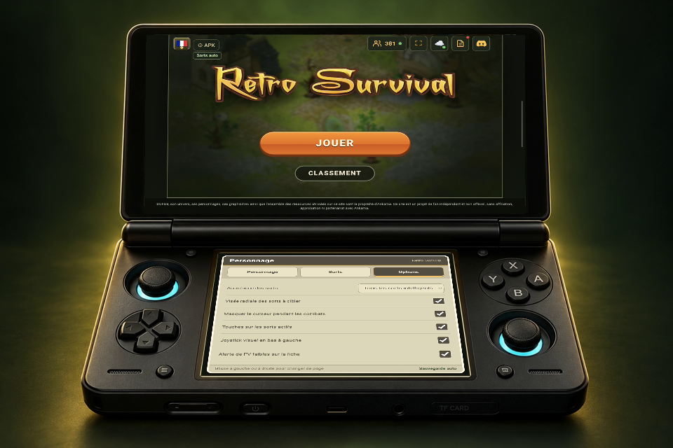

# Retro Survival — Android & manettes

**Au tactile ou à la manette. À toi de choisir ton aide.**

Joue à [Retro Survival](https://retrosurvival.online/) sur téléphone, tablette ou console Android, dont l’**AYN Thor**.

### [⬇ Télécharger l’APK](https://github.com/empy94/retro-survival-thor/releases/latest/download/Retro-Survival-Android.apk)

Android 9+ · Connexion Internet nécessaire · Français / English / Español

10 secondes de gameplay réel · APK 1.11.0 · Deux écrans enregistrés simultanément, intégrés dans un visuel du Thor.

**Mise à jour 1.20.2 :** réduction de la charge des menus sur Thor, notamment le classement ; compatibilité avec la dernière révision du 10 octobre conservée.

## Trois façons de jouer

Dans **⚙ APK / Select → Assistance des sorts** :

| Mode | Ce qu’il fait |
|---|---|
| **Désactivée** | Tu lances tes sorts actifs toi-même. |
| **Buffs auto uniquement** | Bonus du personnage (bouclier, vitesse…) dès disponibilité. Effets actifs conservés ; attaques et visée manuelles. |
| **Tous les sorts intelligents** | Buffs, attaques dirigées, zones sur les groupes et déplacements de secours évalués. |

Les sorts déjà automatiques du jeu restent automatiques dans les trois modes. Tes commandes manuelles sont prioritaires ; l’aide s’arrête pendant les choix, la pause et hors de l’application. Elle ne garantit pas la survie.

**Auto avec tes exceptions :** sur le second écran, touche une icône dans **Sorts → Féca / Iop / Sram** pour garder ce sort manuel. Tes choix sont sauvegardés par classe ; les autres sorts suivent le mode global.

## Mises à jour de l’application

L’APK vérifie la dernière version stable publiée sur GitHub au lancement et environ une fois par jour en arrière-plan, selon les restrictions d’Android. Dans **⚙ APK / Select**, utilise **Vérifier les mises à jour APK** ou active **Notifications de nouvelles APK**. Android 13+ demande l’autorisation d’envoyer des notifications. Un refus laisse la vérification manuelle disponible.

L’alerte ouvre le téléchargement de l’APK officielle ; Android te demande ensuite de confirmer son installation. Installe-la par-dessus l’application avec la même signature pour conserver les données. Cette fonction nécessite **1.16.0 ou plus** : les anciennes APK doivent être mises à jour une première fois manuellement. Une publication GitHub avec l’asset `Retro-Survival-Android.apk` et un tag stable supérieur déclenche la détection ; une APK seulement reconstruite sur le PC ne la déclenche pas.

## Une manette, une visée simple

- **Stick gauche / croix** : déplacement et sélection dans les menus.
- **Stick droit** : direction et distance de visée ; pointeur si nécessaire.
- **L1 / R1 / L2 / R2** : maintenir un sort à viser, orienter, relâcher.
- **X / Y puis A / B** : sorts en combat. **A / R3** : valider dans les menus. **Start** : pause.

**Tes raccourcis, par classe :** choisis une touche ou une combinaison comme **L1 + Y**, sous chaque icône dans **Sorts** ou **⚙ APK → Raccourcis des sorts**. Disponible aussi sur téléphone ; sauvegarde automatique.

Le rayon suit le personnage et les améliorations de portée. Le curseur se masque quand il est inutile. Le tactile et les manettes USB/Bluetooth reconnues par Android restent disponibles.

| Téléportation : choisir la direction | Glyphe : choisir où le placer |
|---|---|
|  |  |

**Maintiens la touche → vise au stick droit → relâche pour lancer.** Pour les zones à placer, l’inclinaison du stick règle aussi la distance.

Exemples du mode radial sur Thor, capturés avec l’interface des versions 1.5/1.6.

## Un second écran utile, si tu en as un

Sur un appareil compatible comme le Thor : cœur de PV, kamas, caractéristiques, équipement et collection permanente. Sur téléphone ou tablette, le jeu fonctionne sur un seul écran.

**Glisse à gauche ou à droite : Personnage → Sorts → Options.** Les onglets restent accessibles au toucher. Règle directement l’assistance, la visée et la sensibilité sur l’écran du bas.

| Auto avec exceptions par sort | Options sur l’écran du bas |
|---|---|
|  |  |

[Voir les sorts en grand](docs/screenshots/second-ecran-sorts.png) · [Éditeur sur un seul écran](docs/screenshots/shortcuts-settings.png) · [Voir les options en grand](docs/screenshots/second-ecran-options.png)

Sorts et raccourcis capturés sur l’APK **1.13.0** signée ; Options sur **1.12.0**, intégrées dans un visuel du Thor. Autres appareils et manettes externes : compatibles selon Android, non testés matériellement.

**Moins de choix répétitifs :** active « Vendre les doublons identiques moins bons » dans les options. Seul un objet déjà équipé, de même identité et sans aucun effet meilleur, est vendu. Nouveaux objets, effets meilleurs, rayonnants et objets permanents restent proposés.

## Installer et jouer

1. Télécharge l’APK ci-dessus, installe-la et ouvre **Retro Survival**.
2. Utilise le tactile ou connecte ta manette dans Android.
3. Sur Thor / Cocoon : **Toutes les applis → Retro Survival → appui long → Ajouter au Menu Home**.

Pour une mise à jour, installe par-dessus l’application existante. Sa sauvegarde est distincte de Chrome. **⚙ APK → Exporter / Restaurer la progression** permet de garder une copie des cartes débloquées, records et objets permanents.

**Android 16 : utilise la version 1.13.2 ou plus récente.** La cible Android a été actualisée pour corriger l’alerte « ancienne version d’Android ». Play Protect peut encore proposer une analyse de cette APK distribuée hors Play Store : laisse cette protection activée. L’application utilise Internet et peut afficher une notification de mise à jour si tu actives cette option. [Explication Google](https://developers.google.com/android/play-protect/warning-dev-guidance).

[Guide complet](docs/guide.md) · [Nouveautés](CHANGELOG.md) · [Tests et limites](VALIDATION.md) · [Code et compilation](docs/guide.md#construire-lapplication)

Lanceur indépendant : le jeu est chargé depuis son site officiel. Non affilié à Retro Survival ou Ankama. Code du lanceur sous licence MIT.

## Version 1.19.3 : révision suivante et visée Enutrof

Prise en charge de `page-DfOhw_qp.js` (SHA-256 `9b75f2de166e5940fa13c107b46b505f31ac0f1f75174345108b9789a4006106`). La version 1.19.2 ne reconnaissait pas cette révision arrivée pendant les essais ; son correctif ne s’appliquait donc pas à ce nouveau module. L’adaptation précédente et son correctif sont conservés séparément.

Les sept sorts ciblés de l’Enutrof suivent désormais le transport tactile maintenir/viser/relâcher, dans le moteur natif comme dans les commandes du Thor. Le planificateur automatique choisit une cible ennemie, suit les portées et améliorations, et évite de redemander un Coffre Animé déjà présent. Les sorts passifs et personnels gardent leur fonctionnement normal.

Vérification : Sufokia a atteint la vague 3 et le choix du niveau 5 après environ 47 secondes de jeu sur le Thor. Le relevé de 90 secondes (incluant cette pause de choix) n’a capturé aucune erreur JavaScript ; médiane des intervalles d’affichage 16,667 ms. Visée contrôlée sur une instance PC isolée du moteur réel : un Lancer de Pelle demandé en (850 ; 605,82) est placé dans la file native à ces mêmes coordonnées, contre (1070 ; 545,82) avant correction. Tests de cibles, portées améliorées, registres et compatibilité des modules réussis. Toutes les vagues n’ont pas été parcourues.
