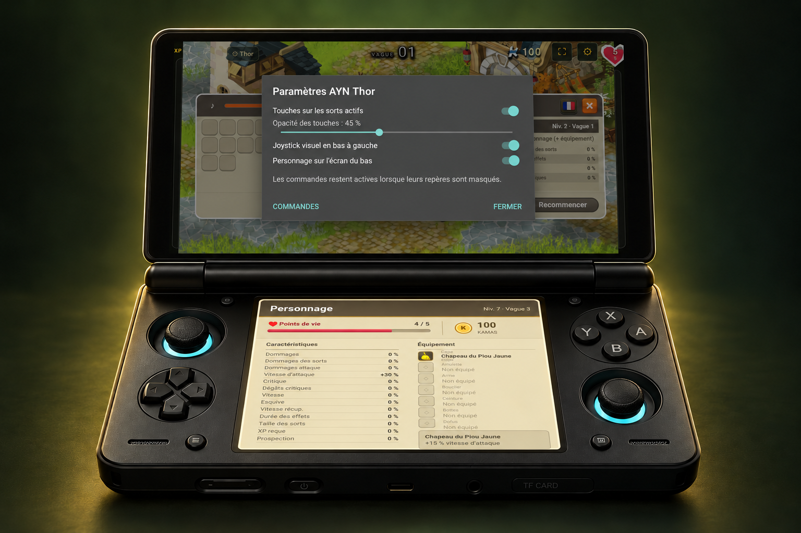
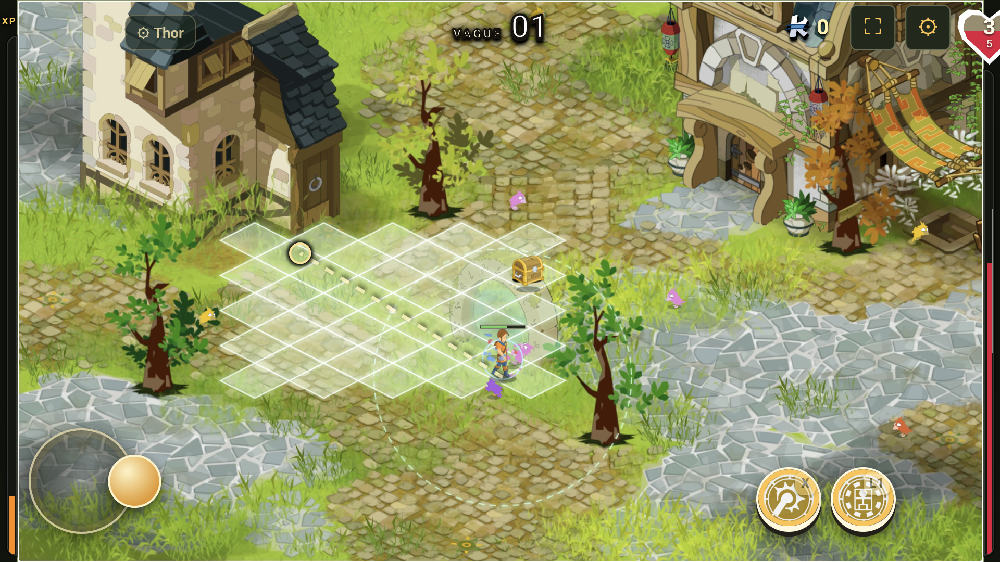
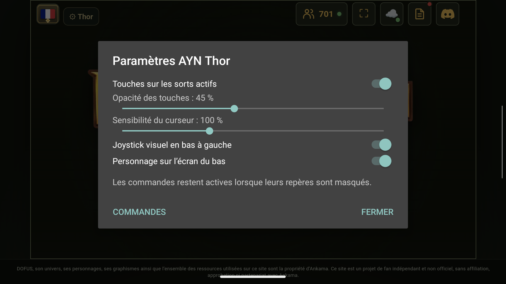
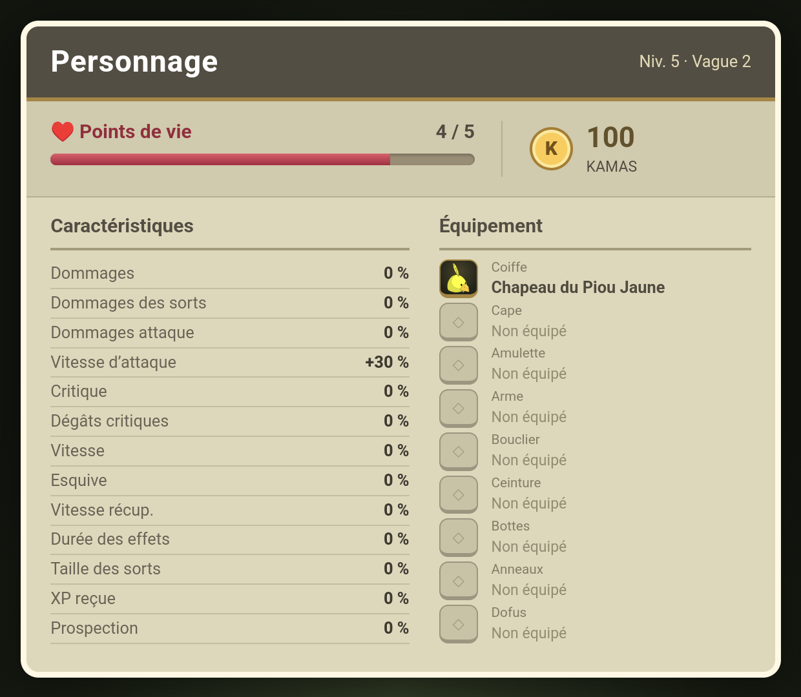
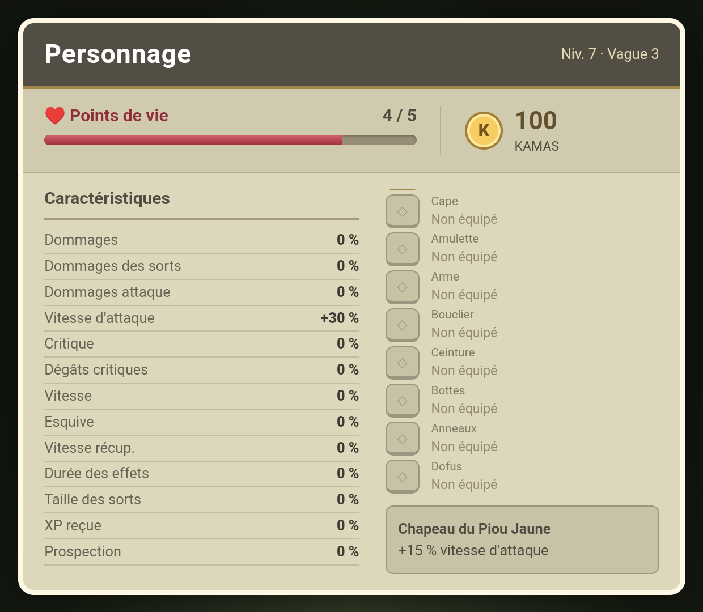
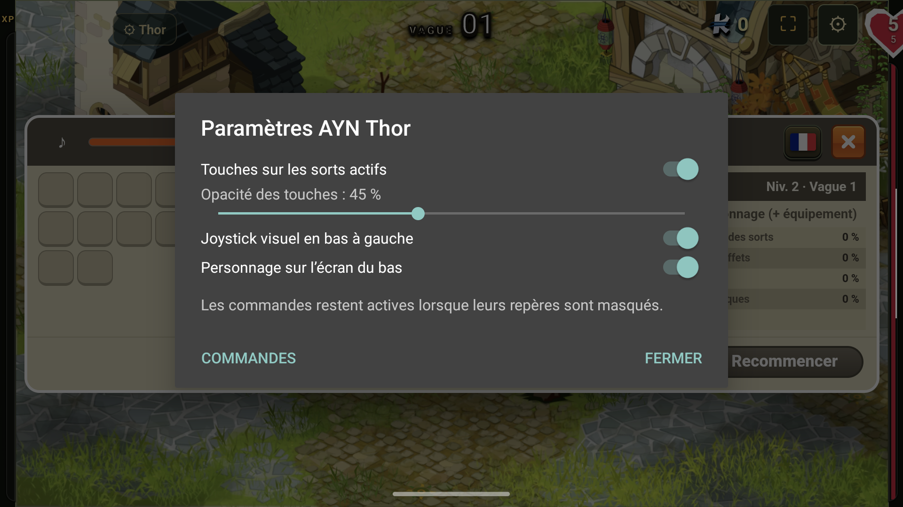
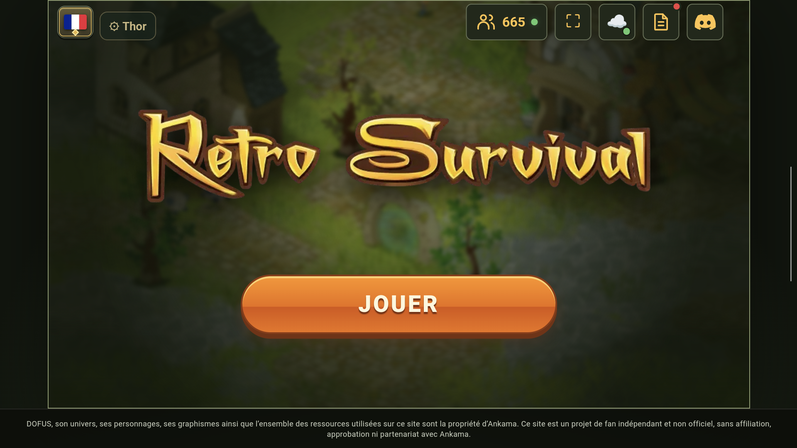
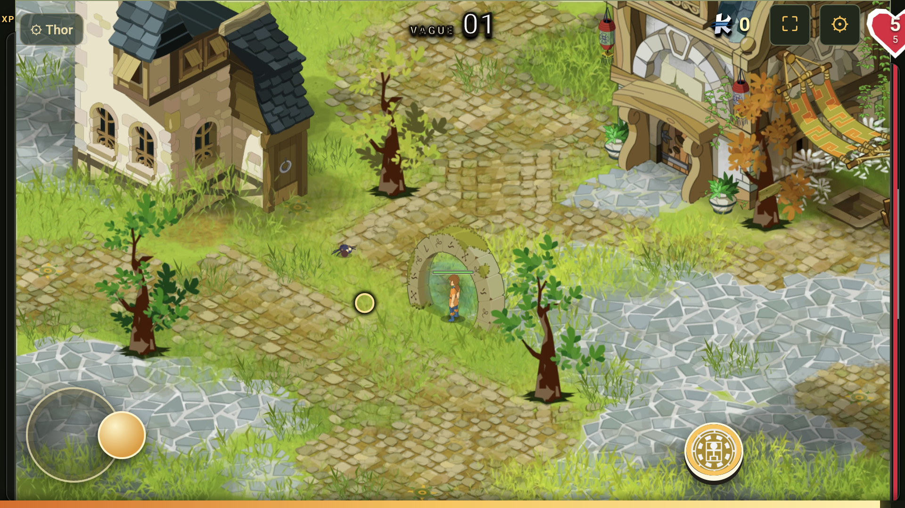
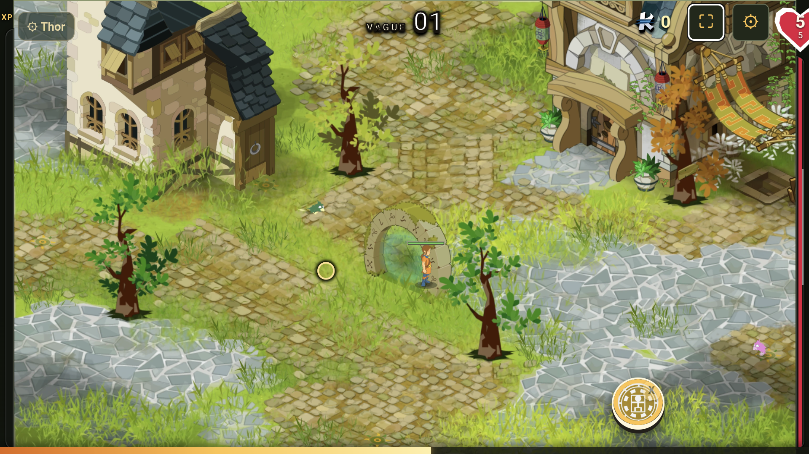
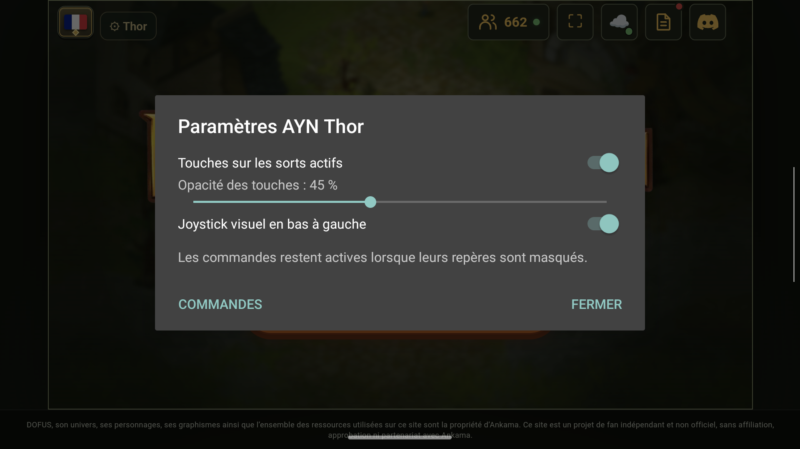

# Retro Survival — AYN Thor

Un lanceur Android pour jouer à [Retro Survival](https://retrosurvival.online/) avec les commandes physiques de l’AYN Thor, tout en conservant l’interface tactile du jeu.

**[Télécharger l’APK](https://github.com/parthi1994/retro-survival-thor/releases/latest)**

## Aperçu sur AYN Thor

**Le jeu en haut, le personnage en bas.**


10 secondes de gameplay réel capturé sur les deux écrans du Thor, intégré dans le visuel de la console. GIF en boucle, sans son, environ 2,1 Mo.

**Paramètres et détails d’équipement.**



Le boîtier est un visuel de présentation généré à partir d’une référence du Thor. Les deux écrans du GIF montrent les enregistrements réels de l’application. Les captures originales sont disponibles dans la galerie ci-dessous. [Création des visuels et référence AYN](docs/visuels.md).

## Deux écrans, deux usages

L’écran du haut conserve le jeu et ses commandes. L’écran du bas affiche une fiche de personnage, dans les couleurs et le style du menu de caractéristiques du jeu :

- PV actuels et maximum, kamas de la partie, niveau et vague.
- 13 caractéristiques calculées par le jeu, bonus d’équipement compris : dommages, critique, vitesse, esquive, récupération, prospection, etc.
- Équipement porté : coiffe, cape, amulette, arme, bouclier, ceinture, bottes, anneaux et Dofus.
- Toucher un objet équipé pour lire ses effets ; faire défiler la colonne si nécessaire.

Les informations s’actualisent deux fois par seconde. Aucun bouton de commande n’est dupliqué sur l’écran inférieur. La fiche se désactive dans **Select / ⚙ Thor → Personnage sur l’écran du bas**. Sur un appareil sans écran secondaire compatible, le jeu fonctionne avec un seul écran.

La fiche lit les informations disponibles dans le jeu, sans modifier la partie. Si le site change et que ces informations deviennent inaccessibles, elle indique qu’elles sont indisponibles plutôt que d’afficher des valeurs inventées.

<details>
<summary>Voir les captures originales sur le Thor</summary>

Version 1.6.0 : placement radial d’un glyphe, direction et distance au stick droit.


Version 1.5.0 : visée radiale de Téléportation, avec rayon centré sur le personnage et direction choisie au stick droit.


Version 1.4.0 :

| Visée depuis le personnage en déplacement | Sensibilité du curseur |
|---|---|
|  |  |

Captures réelles de la version 1.2.0, avant mise en situation dans les visuels du Thor.

| Fiche de personnage | Effets de l’équipement |
|---|---|
|  |  |



Commandes et interface de la version 1.1.0 :

| Accueil | Joystick en bas à gauche |
|---|---|
|  |  |
| **Touche X sur un sort débloqué** | **Réglage des repères** |
|  |  |

</details>

## Installation

1. Télécharger `Retro-Survival-Thor.apk` depuis la dernière version publiée.
2. Installer l’APK sur le Thor et ouvrir **Retro Survival**.
3. Dans Cocoon : **Toutes les applis → Retro Survival → appui long → Ajouter au Menu Home**.

Une connexion Internet et Android 9 ou plus sont nécessaires. L’application a été testée sur AYN Thor avec Android 13. Elle ne contient pas le jeu : elle charge le site en ligne.

## Commandes

| Touche | Action |
|---|---|
| Stick gauche / croix | Déplacement avec le joystick tactile du jeu |
| Stick droit | Déplacement du pointeur doré |
| R3 / A | Clic tactile à la position du pointeur |
| L1, R1, L2, R2 | Priorité aux sorts à viser |
| X, Y | Priorité aux sorts instantanés |
| Bouton de sort maintenu + stick droit | Viser, puis relâcher pour les sorts directionnels |
| Start / B | Pause et reprise |
| Select / bouton **⚙ Thor** | Paramètres des commandes |

Les menus et les choix de niveau se sélectionnent au pointeur avec R3. Le tactile reste disponible. Les attaques automatiques du mode Android restent gérées par le jeu.

En **visée au pointeur**, la trajectoire des sorts à viser part du personnage et suit ses déplacements pendant le maintien. Le point ciblé reste à l’endroit choisi à l’écran ; le stick droit permet de l’ajuster. La direction du lancement est recalculée au relâchement. La portée et les contraintes du sort restent celles du jeu.

Depuis la version **1.5.0**, **Téléportation du Féca** et **Bond du Iop** utilisent une visée radiale : maintenir la touche du sort pour afficher sa portée autour du personnage. La destination est d’abord devant lui, dans la direction du stick gauche (ou son orientation à l’arrêt). Le **stick droit choisit directement la direction**, sans déplacer la souris ; cette direction reste choisie quand le stick revient au centre. Relâcher la touche du sort pour lancer à portée maximale. Le rayon et la destination suivent le personnage pendant son déplacement, en tenant compte des améliorations de portée. Le jeu décide de la position d’arrivée selon les limites du terrain et les obstacles.

Le curseur habituel est masqué pendant cette visée et retrouve sa position précédente ensuite. L’évolution de Téléportation permettant un retour garde sa destination imposée et l’indique à l’écran.

Depuis la version **1.6.0**, la visée radiale est également activée par défaut pour les **sorts à cibler ou à placer**. Maintenir la touche du sort, choisir la direction au stick droit, puis relâcher pour lancer. Pour les glyphes, pièges, invocations et attaques dont la distance est réglable, incliner légèrement le stick pour viser près et à fond pour viser loin. Direction et distance restent choisies quand le stick revient au centre, et la cible suit le personnage.

Le rayon suit la portée actuelle du sort : améliorations et évolutions de portée de Téléportation, Bond, Retour du Bâton et Couper prises en compte. Les glyphes ont actuellement une portée de placement fixe de 200 unités du jeu ; agrandir leur zone d’effet ne permet pas de les poser plus loin. Les attaques purement directionnelles, comme Épée du Destin et Peur, montrent une direction sans annoncer un rayon de portée. Le Double du Sram se place dans son rayon d’invocation ; son évolution d’échange avec un Double existant indique ce point imposé.

Pour retrouver la visée au pointeur sur les sorts ciblés, désactiver **Select / ⚙ Thor → Visée radiale des sorts à cibler**. Téléportation et Bond conservent leur mode radial. Les sorts instantanés se lancent toujours par une simple pression.

## Affichage réglable

- Le joystick visuel du stick gauche est fixé dans le coin inférieur gauche pendant le déplacement.
- Les sorts actifs débloqués affichent leur bouton physique : **X, Y, L1, R1, L2, R2**.
- Depuis la version **1.3.0**, les sorts à viser (glyphes, pièges, déplacements ciblés…) occupent d’abord **L1, R1, L2, R2**. Maintenir la touche, viser au stick droit, puis relâcher pour lancer. Les sorts instantanés occupent d’abord **X et Y**, puis les boutons encore libres. Lire les repères sur les sorts après un déblocage : les affectations peuvent changer.
- L’évolution du Glyphe enflammé qui supprime la visée est reconnue comme un sort instantané. Six sorts au maximum sont associés aux boutons ; les autres restent accessibles au tactile ou avec le pointeur et R3.
- Dans **⚙ Thor** ou avec **Select**, afficher ou masquer ces étiquettes et régler leur opacité entre 15 % et 85 %.
- Régler aussi la **sensibilité du curseur** de **25 %** (précis) à **250 %** (rapide), avec **100 %** par défaut. Ce réglage s’applique au déplacement du pointeur dans les menus et à la visée au pointeur. La visée radiale des téléportations utilise directement la direction du stick.
- Le joystick visuel peut être masqué sans désactiver le déplacement.
- Les préférences restent enregistrées après fermeture et mise à jour de l’application.

La sauvegarde locale de cette application est distincte de celle de Chrome. Installer une mise à jour par-dessus l’application existante pour conserver ses données. Une version reconstruite avec une autre clé de signature ne peut pas remplacer directement l’APK publié.

## Construire l’application

Sous Windows, installer un JDK et les outils Android SDK : plateforme `android-35` et Build Tools `34.0.0`. Java 17 ou 19 est recommandé avec cette version de D8 ; la compilation avec Java 19 a été vérifiée.

```powershell
$env:ANDROID_SDK_ROOT = 'C:\Android\Sdk'
$env:JAVA_HOME = 'C:\Java\jdk-19'
.\build.ps1
```

Les chemins sont également configurables par les paramètres `-AndroidSdk` et `-JavaHome`. L’APK signé est produit dans `Retro-Survival-Thor.apk`. La clé de signature personnelle est créée hors du dépôt, dans `%USERPROFILE%\.android\thor-retrosurvival`. Conserver cette clé pour les mises à jour et ne jamais la publier.

Le paramètre `-Debug` produit un APK séparé avec le débogage WebView activé, uniquement pour les essais. L’APK publié n’active pas ce débogage.

Avec Node.js, `node tests/telemetry.test.js` vérifie le contrat de lecture des informations du personnage, dont les données indisponibles, les totaux et l’absence de modification du jeu. `node tests/spell-bindings.test.js` vérifie la priorité des sorts à viser, l’exception du Glyphe enflammé, la limite de six boutons, le relâchement du bon bouton et l’annulation de la visée.

`node tests/aim-follow.test.js` vérifie une visée dont la cible reste fixe pendant le déplacement du personnage, le calcul au relâchement et l’annulation si sa position est indisponible. Le test de l’observateur vérifie aussi les coordonnées du personnage après mise à l’échelle du canvas et remplacement de la partie.

`node tests/travel-aim.test.js` vérifie la direction initiale, le suivi du personnage, le choix direct au stick droit, la direction conservée au retour au centre, la portée améliorée, le retour imposé et la restauration du pointeur pour les autres sorts.

## Projet indépendant

Cette application est un lanceur et une adaptation des commandes. Elle n’est affiliée ni aux auteurs de Retro Survival ni à Ankama. Le jeu, ses illustrations et son contenu restent la propriété de leurs auteurs et ayants droit. Les captures ci-dessus montrent le jeu chargé depuis son site ; le dépôt ne contient pas ses scripts ni ses fichiers graphiques, hormis ces captures de présentation. Le site peut évoluer et nécessiter une mise à jour des commandes.

Le code original de ce lanceur est distribué sous licence MIT.
